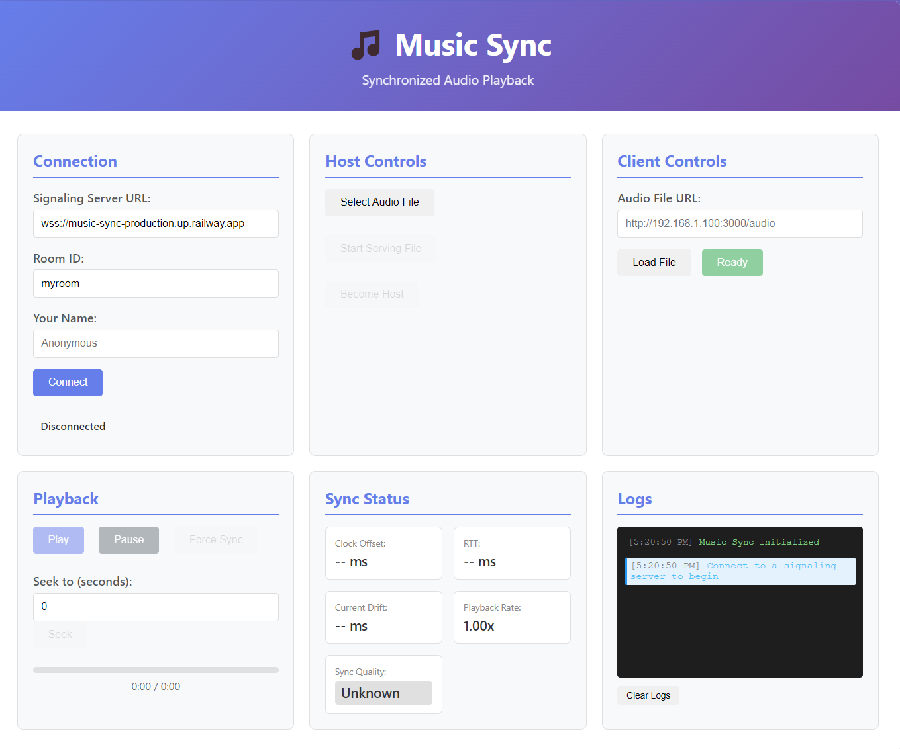

# Music Sync - Landing Page

A modern, responsive landing page for Music Sync, a real-time synchronized audio playback application built with Electron. The website showcases the app's features, technology stack, and provides download links.



## 🚀 Features

- **Modern Design**: Clean, glassmorphic UI with smooth animations and transitions
- **Dark Mode Support**: Seamless theme switching with system preference detection
- **Fully Responsive**: Optimized for desktop, tablet, and mobile devices
- **Performance Optimized**: Built with Next.js 14 for optimal loading and SEO
- **Animated Sections**: Framer Motion animations with intersection observers for engaging UX
- **Accessible**: WCAG compliant with proper ARIA labels and semantic HTML

## 🛠️ Tech Stack

- **Framework**: Next.js 14 (App Router)
- **Language**: TypeScript
- **Styling**: Tailwind CSS
- **Animations**: Framer Motion
- **Icons**: Lucide React, React Icons
- **Theme**: next-themes
- **UI Components**: Radix UI (Dialog)

## 📦 Installation

1. **Clone the repository**
```bash
git clone https://github.com/EternalKnight002/music-sync-web.git
cd music-sync-web
```

2. **Install dependencies**
```bash
npm install
# or
yarn install
# or
pnpm install
```

3. **Run the development server**
```bash
npm run dev
# or
yarn dev
# or
pnpm dev
```

4. **Open your browser**
Navigate to [http://localhost:3000](http://localhost:3000)

## 🏗️ Project Structure

```
music-sync-web/
├── src/
│   ├── app/
│   │   ├── globals.css        # Global styles and theme variables
│   │   ├── layout.tsx         # Root layout with header and footer
│   │   └── page.tsx           # Home page with all sections
│   ├── components/
│   │   ├── AnimatedHero.tsx       # Hero section with animations
│   │   ├── FeaturesSection.tsx    # Features grid
│   │   ├── AppFeaturesSection.tsx # Technical features
│   │   ├── BrandSection.tsx       # Technology stack showcase
│   │   ├── CTASection.tsx         # Download CTA
│   │   ├── ThemeToggle.tsx        # Dark/light mode toggle
│   │   ├── Modal.tsx              # Reusable modal component
│   │   └── VideoPlayer.tsx        # Custom video player
│   └── types/
│       └── global.d.ts        # TypeScript declarations
├── data/
│   └── extensions.json        # App metadata
├── public/
│   ├── screenshots/           # App screenshots
│   └── videos/                # Demo videos
├── tailwind.config.js         # Tailwind configuration
├── tsconfig.json              # TypeScript configuration
└── package.json               # Dependencies and scripts
```

## 📝 Key Components

### Hero Section
Animated hero with floating feature cards showcasing the app's main benefits and desktop mockup.

### Features Section
Grid layout highlighting three core features:
- Perfect Synchronization
- Host/Client Architecture
- LAN & Internet Support

### App Features Section
Technical deep-dive with architecture visualization:
- NTP-Style Clock Sync
- Adaptive Playback Control
- WebSocket Signaling Server

### Brand Section
Displays the technology stack with animated icons.

### CTA Section
Download section with app preview and feature highlights.

## 🎨 Customization

### Theme Colors
Edit theme variables in `src/app/globals.css`:
```css
:root {
  --bg: #ffffff;
  --text: #0f172a;
  --muted: #6b7280;
  --card-bg: rgba(255,255,255,0.7);
}

.dark {
  --bg: #0a0e1a;
  --text: #e6eef9;
  --muted: #94a3b8;
  --card-bg: rgba(15,20,35,0.7);
}
```

### Content
Update app metadata in `data/extensions.json`:
```json
{
  "title": "Music Sync",
  "shortDesc": "Your description",
  "githubUrl": "https://github.com/...",
  "downloadUrl": "https://github.com/.../releases/latest"
}
```

### Screenshots
Place your screenshots in `public/screenshots/`:
- `music-sync-main.jpg` - Hero section
- `music-sync-connected.jpg` - CTA section

## 🚀 Deployment

### Vercel (Recommended)
```bash
npm run build
vercel deploy
```

### Other Platforms
```bash
npm run build
npm start
```

The built app is static and can be deployed to any hosting platform that supports Next.js.

## 📄 Scripts

- `npm run dev` - Start development server
- `npm run build` - Build for production
- `npm run start` - Start production server
- `npm run lint` - Run ESLint
- `npm run typecheck` - Check TypeScript types

## 🤝 Contributing

Contributions are welcome! Please feel free to submit a Pull Request.

1. Fork the repository
2. Create your feature branch (`git checkout -b feature/AmazingFeature`)
3. Commit your changes (`git commit -m 'Add some AmazingFeature'`)
4. Push to the branch (`git push origin feature/AmazingFeature`)
5. Open a Pull Request

## 📧 Contact

**Aman Kumar**
- GitHub: [@EternalKnight002](https://github.com/EternalKnight002)
- Twitter: [@Eternalknigh](https://x.com/Eternalknigh?t=9zzpTY3YIyS5hs7ts27LmQ&s=09)
- LinkedIn: [Aman Kumar](https://linkedin.com/in/aman-kumar-537a73296)

## 📜 License

This project is licensed under the MIT License - see the [LICENSE](LICENSE) file for details.

## 🙏 Acknowledgments

- Built with [Next.js](https://nextjs.org/)
- Styled with [Tailwind CSS](https://tailwindcss.com/)
- Animated with [Framer Motion](https://www.framer.com/motion/)
- Icons from [Lucide](https://lucide.dev/) and [React Icons](https://react-icons.github.io/react-icons/)

---

Made with ❤️ for the Music Sync project